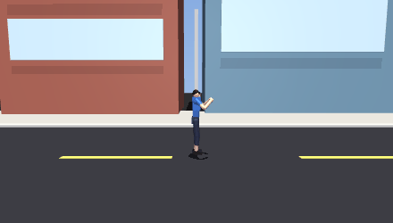

# humanoid-rl

Teach a MuJoCo humanoid to walk with deep reinforcement learning — one CLI, reproducible runs, and a policy you can actually watch.

<p align="center">
  
</p>

<p align="center">
  <em>PPO after 15.1M steps — 10,092 reward over 868 steps, rendered with <code>--scene street</code>.</em>
</p>

```bash
python -m humanoid_rl train          # learn a gait
python -m humanoid_rl play           # watch it in a 3D window
```

---

## What this is

A small, honest reinforcement-learning project built on **MuJoCo**, **Gymnasium** and **Stable-Baselines3**. The agent starts as a ragdoll that collapses instantly and, given enough steps, works out how to stay upright and move forward.

Four things it does properly, which most tutorial versions skip:

- **Observation normalisation travels with the policy.** Statistics are saved next to every checkpoint, so a policy that scored well during training scores the same when you play it back.
- **Every run is self-describing.** `config.json` records the exact settings — including the task — so `play`, `record` and `eval` need no flags. They read them.
- **Being stopped keeps your work.** Ctrl-C *and* `kill` both save the policy rather than throwing away hours of compute. Only `kill -9` can still lose it, which is what the periodic checkpoints are for.
- **Tuned defaults.** PPO and SAC ship with hyperparameters adapted from RL Baselines3 Zoo, not library defaults that never learn to walk.

## Install

```bash
python -m venv .venv && source .venv/bin/activate
pip install -e .
```

Optional musculoskeletal environments (MyoSuite):

```bash
pip install -e '.[myo]'
```

## Use

| Command | What it does |
| --- | --- |
| `train` | Learn a policy, writing checkpoints and TensorBoard logs |
| `play` | Open a MuJoCo window and watch a policy |
| `record` | Render episodes to `.mp4` / `.gif` — no display needed |
| `eval` | Score a policy over N episodes, headless and fast |
| `compare` | Score several checkpoints of a run and rank them |
| `plot` | Write a learning-curve PNG from the episode logs |
| `ls` | List saved runs |

```bash
# Train PPO on Humanoid-v5 with the tuned defaults
python -m humanoid_rl train

# Fewer steps for a quick smoke test
python -m humanoid_rl train --steps 200_000 --n-envs 4

# SAC instead — far fewer steps to a gait, slower per step
python -m humanoid_rl train --algo sac --steps 2e6

# Pick up where you left off
python -m humanoid_rl train --resume latest --steps 5e6

# Override any hyperparameter without touching the code
python -m humanoid_rl train --set learning_rate=1e-4 --set batch_size=512

# Watch, record, score
python -m humanoid_rl play --episodes 3
python -m humanoid_rl record --out walk.gif --width 320 --height 240 --every 3
python -m humanoid_rl eval --episodes 20

# Which checkpoint is actually best, and how did it get there
python -m humanoid_rl compare --episodes 10
python -m humanoid_rl plot
```

`compare` matters more than it sounds. PPO oscillates around a plateau rather than
converging, so a later checkpoint is regularly worse than an earlier one — on this
project's own run, 17.4M steps scored 6,040 against 15.1M's 7,679. `compare` scores
several checkpoints, ranks them, and warns you when the newest is not the best.

Every command defaults to the most recent run. Target an older one with `--run <name>`, and choose which checkpoint with `--model best|final|last`.

## Tasks

Stock `Humanoid-v5` rewards exactly one thing: run forward as fast as possible. A policy trained on it has no notion of a *command* — you cannot ask it to walk slowly, or to walk somewhere in particular.

`--task` swaps the objective. Each variant replaces the environment's forward-velocity reward with a command-tracking one — the healthy bonus and the control and contact costs are left alone — and appends the command to the observation.

| Task | The humanoid is asked to | Observation |
| --- | --- | --- |
| `walk` *(default)* | run forward as fast as it can | 348 |
| `natural` | the same, but without lurching, flailing or weaving | 348 |
| `velocity` | hold a commanded forward speed | 349 |
| `goal` | walk to a point on the ground and stop | 351 |

```bash
python -m humanoid_rl train --task velocity
python -m humanoid_rl train --task goal
python -m humanoid_rl train --task velocity,natural   # combine them
python -m humanoid_rl train --env HumanoidStandup-v5  # already in Gymnasium
```

Tasks compose with commas. At most one of `velocity` and `goal` — both replace the
forward reward, and applying both would subtract it twice.

### Why `natural` exists

Measured on this project's own trained policy:

| | measured | for scale |
| --- | --- | --- |
| forward speed | **5.42 m/s** | a human walk is ~1.4 m/s, a jog ~3 m/s |
| torso lean | **31° off vertical** | upright is 0° |
| sideways speed | **1.82 m/s** | walking in a line is ~0 |

The policy is not walking badly. It is **sprinting at roughly 19 km/h with a 31°
forward lean**, which is a controlled fall repeated several times a second. That is
the correct solution to the reward it was given: `1.25 × forward_speed` with no
upper bound, and nothing at all about posture.

`natural` adds three penalties — arm joint speed, torso tilt, lateral drift — while
leaving the objective alone. `velocity` removes the incentive to sprint by asking
for a *specific* speed. Together, `--task velocity,natural` asks for a walk instead
of a sprint and for tidy posture while doing it.

The weights are deliberately mild. Penalties strong enough to force good posture
immediately also stop the policy learning to walk at all — standing still scores
better than falling, and it will happily take that deal.

`natural` changes no observations, so it can also be used to *measure* an existing
policy: every component is published in `info` as `cost_arm`, `cost_tilt`,
`cost_drift`, `uprightness` and `arm_motion`.

The command is **resampled every episode**. That is the part that matters: a fixed command lets a policy memorise one behaviour and ignore the instruction entirely, which looks like it works right up until you ask for something different.

Two details worth knowing:

- **Velocity tracking is a Gaussian around the target**, so running too fast is penalised exactly like running too slow. That is the difference between a gait you can control and a sprint.
- **Goal-reaching rewards progress made each step**, not distance remaining. A distance penalty gives a policy that cannot yet walk almost no gradient to follow.

The task is written into `config.json`, so playback reconstructs it without flags:

```bash
python -m humanoid_rl eval --run runs/latest     # rebuilds the right task
```

Stand-up needs no code here — Gymnasium already ships `HumanoidStandup-v5`.

## Scenes

The stock MuJoCo humanoid is a stack of capsules on a checkerboard. `--scene`
swaps that for something you can actually watch:

```bash
python -m humanoid_rl play --scene street
python -m humanoid_rl record --scene street --width 440 --height 250 --every 5 --out street.gif
```

| Scene | What you get |
| --- | --- |
| `default` | Gymnasium's stock model and checkerboard floor |
| `street` | A clothed figure walking a road lined with buildings |

**A scene changes appearance and nothing else, so any policy works in any scene
with no retraining.** That is not a claim to take on trust — it is enforced:

- Decorative geoms carry `density="0" contype="0" conaffinity="0"`. The model
  sets `inertiafromgeom="true"`, so a zero-density geom adds no mass and no
  inertia. The original collision geoms are untouched apart from their alpha.
- `tests/test_scene.py` asserts every scene matches the stock model on body
  mass, inertia, centre of mass, damping, armature, joint ranges and actuator
  gears — then steps both models through 50 identical actions and requires the
  observations to match to 1e-8.

A scene that broke the physics would fail CI rather than quietly degrade a gait.

Note that `eval` has no `--scene` flag: it renders nothing, and since scenes are
physically identical the numbers would be the same anyway.

## Anatomy of a run

```
runs/20260821-142530-humanoid-v5-ppo/
├── config.json          exact settings used, plus how far it actually got
├── best_model.zip       highest evaluation reward so far
├── final_model.zip      last policy — written even on Ctrl-C
├── vecnormalize.pkl     observation statistics for that policy
├── checkpoints/         periodic snapshots
├── monitor/             per-episode reward CSVs
└── tb/                  TensorBoard event files
```

```bash
tensorboard --logdir runs/latest/tb
```

Watch `rollout/ep_rew_mean` climb. On `Humanoid-v5` a reward around 1000 means the humanoid stays upright for a while; 5000+ is a real walking gait.

## What to expect

Measured on an Apple M1 Mac mini (8 cores, 16 GB), PPO with the tuned defaults:

| | Throughput | 10M steps |
| --- | --- | --- |
| `--n-envs 4` | ~1250 steps/s | ~2.2 h |
| `--n-envs 8` | ~1500 steps/s | ~1.9 h |

Progress of one real run, scored over 20 deterministic episodes at each stage:

| Steps trained | Mean reward | Mean episode length |
| --- | --- | --- |
| 0 (random actions) | 125 | 25 / 1000 |
| 8.9M | 3,839 ± 2,057 | 386 |
| 15.1M | **7,679 ± 3,882** | **678** |

The best episodes at 15.1M run the full 1000 steps for ~12,000 reward. **The spread is the honest part of this table**: roughly a quarter of episodes still end early with a fall, which is why the standard deviation is half the mean. The GIF above is a good episode, not an average one.

Two things worth knowing if you train this yourself:

- **Judge it on episode length, not reward.** A policy scoring 4,000 by surviving 400 of 1000 steps is still falling over; the reward alone hides that.
- **More steps is not monotonic.** A checkpoint at 17.4M scored *worse* than the one at 15.1M (6,040 / 535 steps). PPO oscillates around a plateau rather than converging cleanly, which is exactly what `best_model.zip` and its paired statistics exist to capture.

## Project layout

```
src/humanoid_rl/
├── cli.py        argument parsing and command dispatch
├── config.py     tuned per-algorithm defaults; serialised into each run
├── envs.py       environment construction shared by training and playback
├── tasks.py      task variants: what the humanoid is asked to do
├── analysis.py   compare checkpoints, plot learning curves
├── assets/       scene XML: appearance only, physics identical to stock
├── runs.py       run directories, checkpoint discovery, `latest` resolution
├── train.py      model construction, callbacks, the learning loop
├── rollout.py    play / record / eval
└── console.py    terminal output
```

## Choosing an algorithm

| | PPO | SAC |
| --- | --- | --- |
| Steps to a decent gait | ~10M | ~2M |
| Parallel envs | 8 (scales well) | 1 |
| Wall-clock per step | fast | slower (gradient step per env step) |
| Stability | very stable | sensitive to seed |

PPO is the default because it parallelises across CPU cores and rarely diverges. Reach for SAC when you are short on sample budget rather than on time.

## Development

```bash
pip install -e '.[dev]'
pytest                    # full suite
pytest -m 'not slow'      # skip anything that builds a MuJoCo env
ruff check .
```

CI runs the suite and the linter on Python 3.10 and 3.12.

## Troubleshooting

**`NSWindow should only be instantiated on the main thread!` on macOS.** You ran `play` under `mjpython`. Use plain `python` instead. Gymnasium does not use MuJoCo's `launch_passive` viewer — it opens its own GLFW window, and GLFW must create that window on the process's main thread. `mjpython` runs your script on a *secondary* thread (it reserves the main one for MuJoCo's Cocoa event loop), so it is the one interpreter that cannot work here. The CLI detects this and says so.

**The viewer dies with `mjv_moveCamera(): incompatible function arguments` when you drag or scroll.** A version mismatch: Gymnasium 1.3 calls MuJoCo's pre-3.12 six-argument camera function, and 3.12 dropped an argument. The window opens fine and only fails when you touch the camera, so it reads like a crash in the policy. `humanoid_rl` shims the function to accept both signatures — if you hit this outside the CLI, call `humanoid_rl.envs.patch_viewer_camera_controls()` first.

**No window appears at all.** It often opens *behind* your terminal — check Mission Control or the Dock. Over SSH or in a headless session there is no display to draw on; use `record` and watch the file.

**Training seems stuck near zero reward.** Humanoid is genuinely hard — a flat curve for the first few hundred thousand steps is normal. Check TensorBoard rather than the terminal, and give PPO at least 2M steps before judging it.

**A GIF comes out enormous.** Render smaller and drop frames: `--width 320 --height 240 --every 3`. The writer's frame rate is divided to match, so playback stays real-time.

**`Unknown environment id`.** MyoSuite environments (`myoLegWalk-v0` and friends) need the `[myo]` extra installed.

**Playback looks worse than training.** Almost always mismatched normalisation statistics. Use the CLI rather than loading checkpoints by hand; it pairs each policy with the stats saved alongside it.

## License

MIT © adebayostephen
